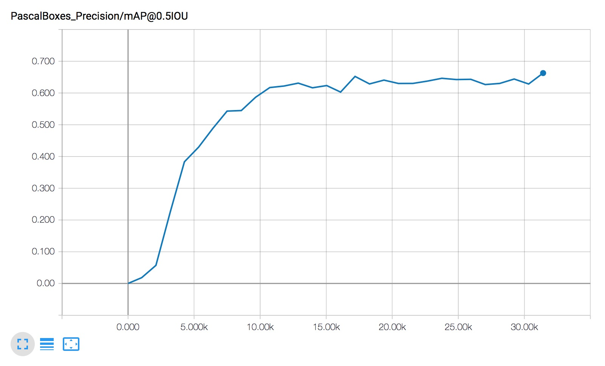
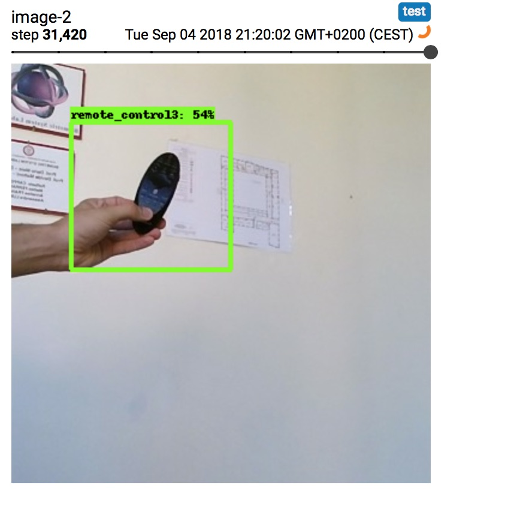
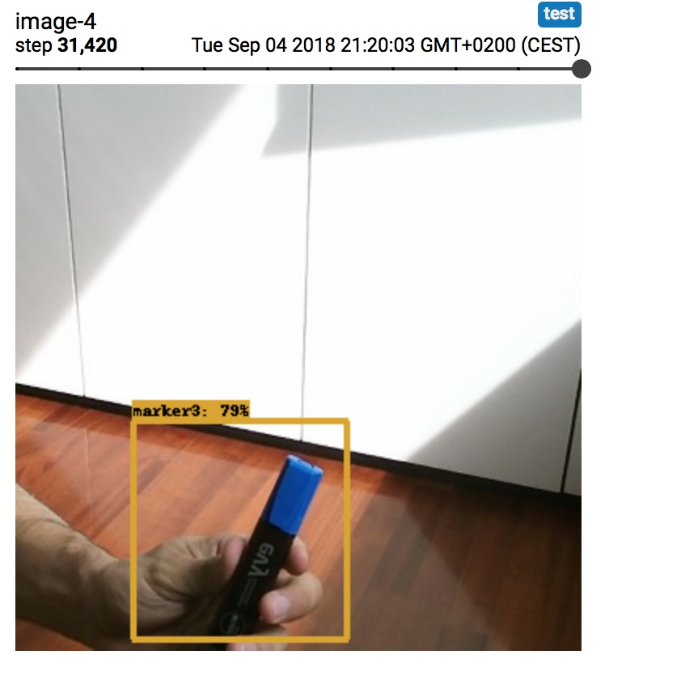

## Description

This folder contains some classes for converting [CORe50]() dataset into tf_records, .pbtxt labels ready to be used with Tensorflow Object Detection API.

* **convert_labels.py**: it converts CORe50 classes into a readable format for tensorflow (.pbtxt)
* **create_csv.py**: it scans CORe50 dataset and it creates a .csv file
* **generate_tfrecord.py**: it writes csv data into a .record file.

## How to use
**1** - **Download CORe50 classes and run the following code**:

`wget https://vlomonaco.github.io/core50/data/core50_class_names.txt`

`python convert_labels.py`

A file called "core_50_labels.pbtxt" should appear in your current directory.

**2** - **Download CORe50 dataset, unzip, convert .png to jpg**.

`wget http://bias.csr.unibo.it/maltoni/download/core50/core50_350x350.zip`

`unzip core50_350x350`

`cd core50_350x350`

`mogrify -format jpg */*.png` (this step will convert all the png files to jpg)

`find . -type f -iname \*.png -delete` (after that you can get rid of .png images)

`cd ..`

**3** - **Download bounding boxes in the same directory:**

`wget https://vlomonaco.github.io/core50/data/bbox.zip`

`unzip bbox.zip`

Now your directory should look something like this:

	core50_350x350/
	 -s1/
	 	-o1
	 	-o2
	 	...
	 	-o50
	 -s2/
	 	-o1
	 	-o2
	 	...
	 	-o50
	 -s3/
	 ...
	 ...
	 -s50/
	 
At the top level you should find:

	bbox/
		s1
		s2
		..
		s11
	
	core50_class_names.txt
 	

**4** - **Convert and match all these data with this script:**

Run the following command to create your .csv file:

`python create_csv.py`

This file will have the format:

[filename, width, height, class, xmin, ymin, xmax, ymax]

**5** - **Create your tf.record**

Once you've got your .csv file you can create tf.record by running:

`python generate_tfrecord.py --csv_input=PATH_TO_FILE.csv  --output_path=OUTPUT_PATH.record`

‼️ Please note that this class requires [**Tensorflow Object Detection API**](https://github.com/tensorflow/models/tree/master/research/object_detection) to be installed in your system.

Check your "OUTPUT_PATH" for finding the tf.record file.

**6** - **Check if your tf.record are correctly created**

[UPDATE]: Since tf records are hardly debuggable I've decided to create a simple script for inspect them:

`python test_record.py --input="train.record"`

`python test_record.py --input="test.record"`

Output will be images, bounding boxes and classes on your terminal.

**7** - **Configure your neural network for Object Detection**

In order to run the training phase, TF obj detection needs to configured through one of [these files](https://github.com/tensorflow/models/tree/master/research/object_detection/samples/configs).
Thus, select your configuration depending on your task/system and the edit the following strings:

	num_classes: 50
	
	fine_tune_checkpoint: "PATH/model.ckpt"
	
	train_input_reader: {
  		tf_record_input_reader {
    		input_path: "PATH/core50_train.record"
  			}
  		label_map_path: "PATH/core_50_labels.pbtxt"
		}
		

Now you can simply run the training phase over CORe50 dataset:

`python legacy/train.py --logtostderr --train_dir=TRAINING_DIR --pipeline_config_path=CONFIG_PATH.config`

## Performances ##
Performances, after 20k iterations, are between 60-65%, using an adaptive learning rate (rms_prop):

  

Some visual results:

## References 📚

* Vincenzo Lomonaco and Davide Maltoni. "[CORe50: a new Dataset and Benchmark for Continuous Object Recognition](http://proceedings.mlr.press/v78/lomonaco17a.html)". Proceedings of the 1st Annual Conference on Robot Learning, PMLR 78:17-26, 2017. 
* [Tensorflow Object Detection API](https://github.com/tensorflow/models/tree/master/research/object_detection)

