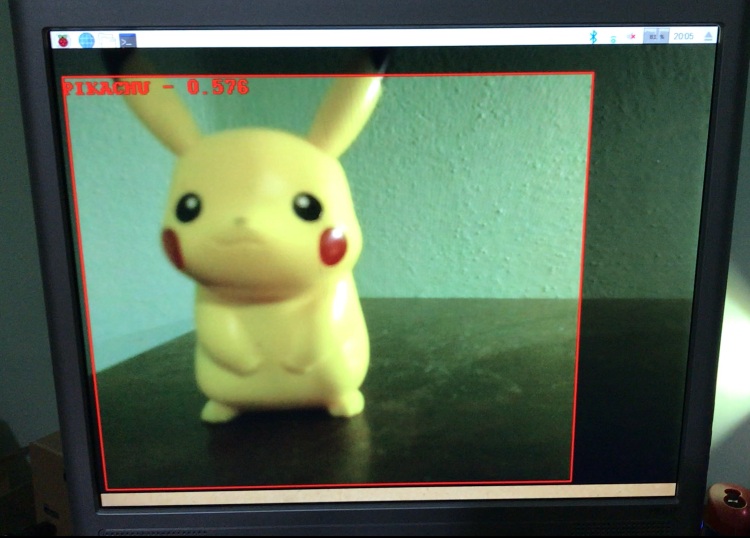

## Pikachu Detector 
Have you ever wondered how to exploit Deep Learning and Google Vision Kit for detecting Pikachu? Well, in that case this project might be interesting for you.

### Files:
* pikachu_object_detection.py: a small library that process .protobinary file
* custom_pikachu_detector.py: a ready to go python executable. Its aim is to reveal the camera, capture the input video and apply inference.
* pikachu_detector.protobinary: a tf frozen graph. It has been trained over a pre-trained coco model, with 10k iterations.

### Deploy:

* Connect through ssh to your Vision Kit
* Move to /home/AIY-projects/src/example/vision
* Clone this repo
* Type `./custom_pikachu_detector` from a shell

### Results:

### References:
* [Custom Vision Training AIY](https://cogint.ai/custom-vision-training-on-the-aiy-vision-kit/) by Chard Hart

## Update 20/01/2019 🔥
I have uploaded a re-trained frozen graph. This should achieve better performances in detection. However, you have to compile it by yourself. It is still based on *embedded_ssd_mobilenet* so it is fully compatible with the Google AIY Vision kit.

This project was used for a seminar held at **University of Bologna** (Cesena Campus) during the course of Machine Learning. Further material is available here:

* [Medium blog post](https://medium.com/@giacomobartoli/hands-on-with-artificial-intelligence-on-the-edge-77b958526c9d)
* [Slides](http://bias.csr.unibo.it/maltoni/ml/Demo/Hands_on_with_EdgeAI.pdf)